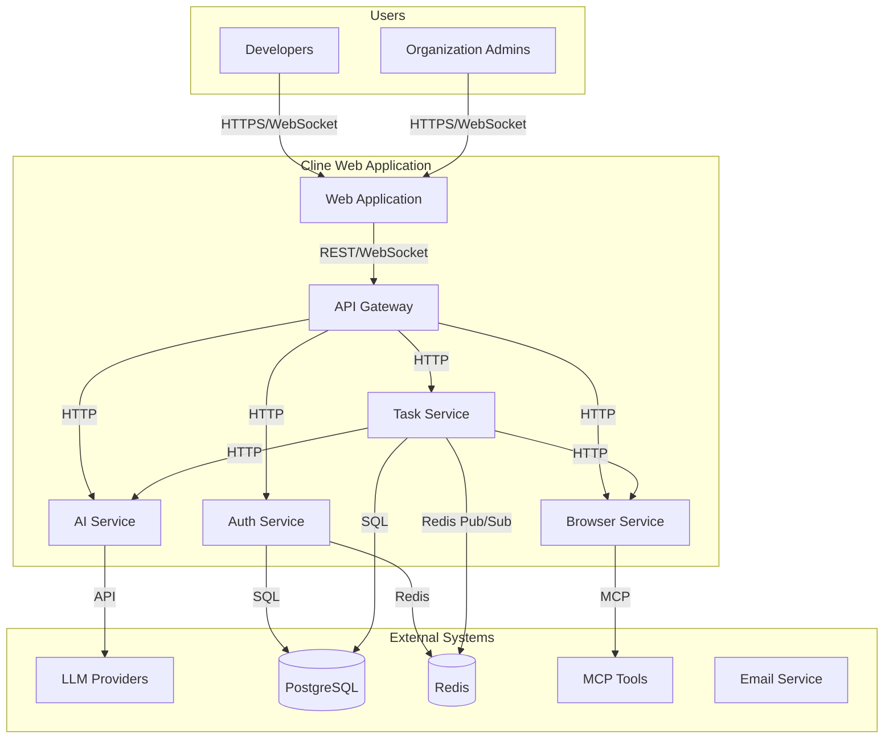

# System Context Diagram (C4 Model Level 1)

## Overview
This diagram shows the Cline Web Application as a single container within the broader system context, interacting with users and external systems.

## Description

### Users
- **Developers**: Primary users who interact with the AI coding assistant
- **Organization Admins**: Manage team settings, billing, and user access

### External Systems
- **LLM Providers**: Anthropic, OpenAI, Google (AI inference)
- **PostgreSQL**: Persistent data storage (users, tasks, messages)
- **Redis**: Session storage, caching, pub/sub for real-time communication
- **MCP Tools**: Model Context Protocol tools for extended functionality
- **Email Service**: Transactional emails (password reset, notifications)

### Internal Containers
- **Web Application**: React frontend with chat interface
- **API Gateway**: Entry point for all API requests, handles auth, rate limiting
- **Auth Service**: User authentication, JWT token management
- **Task Service**: Core task execution engine with checkpoint system
- **AI Service**: Multi-provider LLM abstraction layer
- **Browser Service**: Puppeteer pool for browser automation
