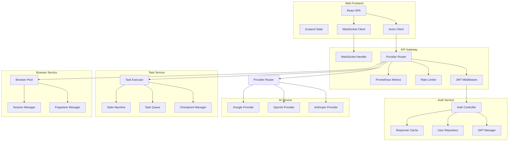

# Container/Component Diagram (C4 Model Level 2)

## Overview
This diagram shows the high-level technical building blocks of the Cline Web Application and their technology choices.

## Technology Stack

### Frontend
- **Framework**: React 18+ with TypeScript
- **Build Tool**: Vite
- **Styling**: Tailwind CSS
- **State Management**: Zustand
- **HTTP Client**: Axios
- **WebSocket**: Native WebSocket API

### Backend - API Gateway
- **Runtime**: Node.js 20+
- **Framework**: Express.js
- **Authentication**: JWT (HS256/RS256)
- **Rate Limiting**: express-rate-limit
- **Metrics**: Prometheus + OpenTelemetry
- **WebSocket**: ws library

### Backend - Auth Service
- **Runtime**: Node.js 20+
- **Framework**: Express.js
- **Database**: PostgreSQL with Knex
- **Cache**: Redis
- **Password Hashing**: bcrypt

### Backend - Task Service
- **Runtime**: Node.js 20+
- **Framework**: Express.js
- **Database**: PostgreSQL
- **Queue**: Redis
- **Checkpoint**: PostgreSQL with JSONB

### Backend - AI Service
- **Runtime**: Node.js 20+
- **Framework**: Express.js
- **Providers**: Anthropic, OpenAI, Google
- **Caching**: Redis

### Backend - Browser Service
- **Runtime**: Node.js 20+
- **Framework**: Express.js
- **Browser**: Puppeteer
- **Session Management**: In-memory + Redis

### Infrastructure
- **Container Runtime**: Docker
- **Orchestration**: Kubernetes
- **Database**: PostgreSQL 15
- **Cache**: Redis 7
- **Message Queue**: Redis Pub/Sub
- **Monitoring**: Prometheus + Grafana
- **Logging**: ELK Stack / Loki
