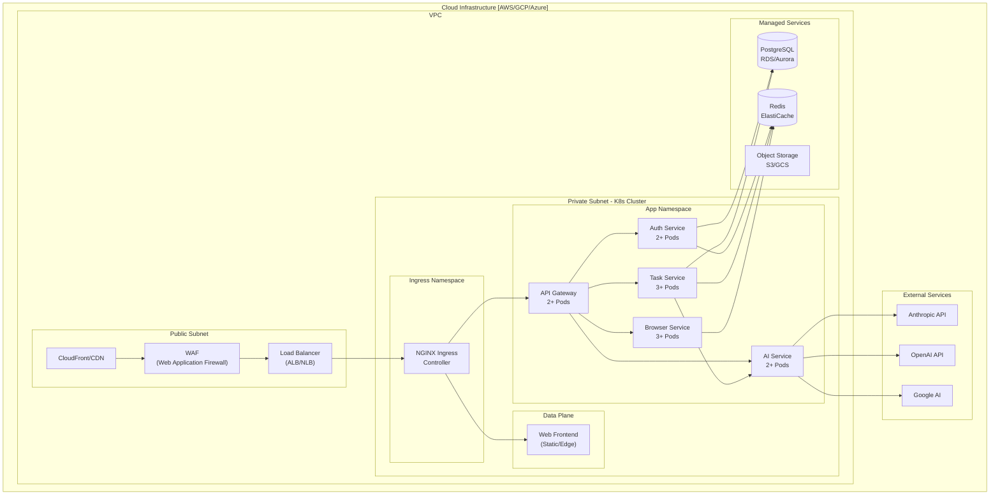

# Deployment/Infrastructure Diagram

## Overview
This diagram shows how the Cline Web Application is deployed on Kubernetes, mapping components to physical infrastructure.



## Kubernetes Resources

### Namespaces
```yaml
# Ingress Namespace
apiVersion: v1
kind: Namespace
metadata:
  name: ingress-nginx
---
# Application Namespace
apiVersion: v1
kind: Namespace
metadata:
  name: cline
```

### Deployments

#### API Gateway
```yaml
apiVersion: apps/v1
kind: Deployment
metadata:
  name: api-gateway
  namespace: cline
spec:
  replicas: 2
  template:
    spec:
      containers:
      - name: gateway
        image: cline/api-gateway:latest
        ports:
        - containerPort: 8080
        resources:
          requests:
            memory: "256Mi"
            cpu: "250m"
          limits:
            memory: "512Mi"
            cpu: "500m"
```

#### Auth Service
```yaml
apiVersion: apps/v1
kind: Deployment
metadata:
  name: auth-service
  namespace: cline
spec:
  replicas: 2
  template:
    spec:
      containers:
      - name: auth
        image: cline/auth-service:latest
        env:
        - name: DATABASE_URL
          valueFrom:
            secretKeyRef:
              name: cline-secrets
              key: database-url
        - name: REDIS_URL
          valueFrom:
            secretKeyRef:
              name: cline-secrets
              key: redis-url
```

### Services
```yaml
apiVersion: v1
kind: Service
metadata:
  name: api-gateway
  namespace: cline
spec:
  type: ClusterIP
  ports:
  - port: 80
    targetPort: 8080
  selector:
    app: api-gateway
```

### Ingress
```yaml
apiVersion: networking.k8s.io/v1
kind: Ingress
metadata:
  name: cline-ingress
  namespace: cline
  annotations:
    nginx.ingress.kubernetes.io/rewrite-target: /
    cert-manager.io/cluster-issuer: letsencrypt-prod
spec:
  tls:
  - hosts:
    - api.cline.dev
    - app.cline.dev
    secretName: cline-tls
  rules:
  - host: api.cline.dev
    http:
      paths:
      - path: /
        pathType: Prefix
        backend:
          service:
            name: api-gateway
            port:
              number: 80
  - host: app.cline.dev
    http:
      paths:
      - path: /
        pathType: Prefix
        backend:
          service:
            name: web-frontend
            port:
              number: 80
```

## Infrastructure Configuration

### Environment Tiers

| Environment | Region | Nodes | Replicas | Database |
|-------------|--------|-------|----------|----------|
| Development | us-east-1 | 3x t3.medium | 1x each | Shared dev DB |
| Staging | us-east-1 | 3x t3.large | 2x each | Staging RDS |
| Production | us-east-1 | 5x t3.xlarge | 3x each | Production RDS |
| DR | us-west-2 | 3x t3.large | 2x each | Read Replica |

### Auto-Scaling
- **HPA**: CPU > 70%, Memory > 80%
- **VPA**: Vertical Pod Autoscaler for memory optimization
- **Cluster Autoscaler**: Add nodes when pods pending > 2 min

### Monitoring Stack
- **Prometheus**: Metrics collection
- **Grafana**: Visualization
- **AlertManager**: Alert routing
- **Loki**: Log aggregation
- **Jaeger**: Distributed tracing
