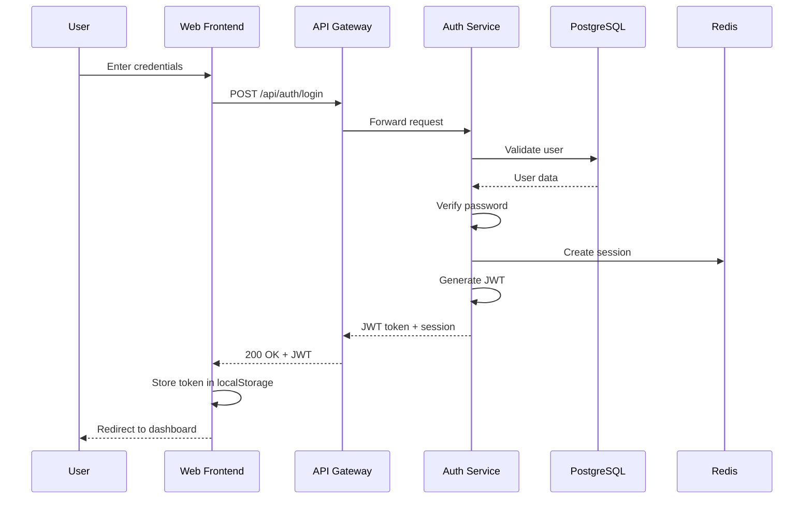
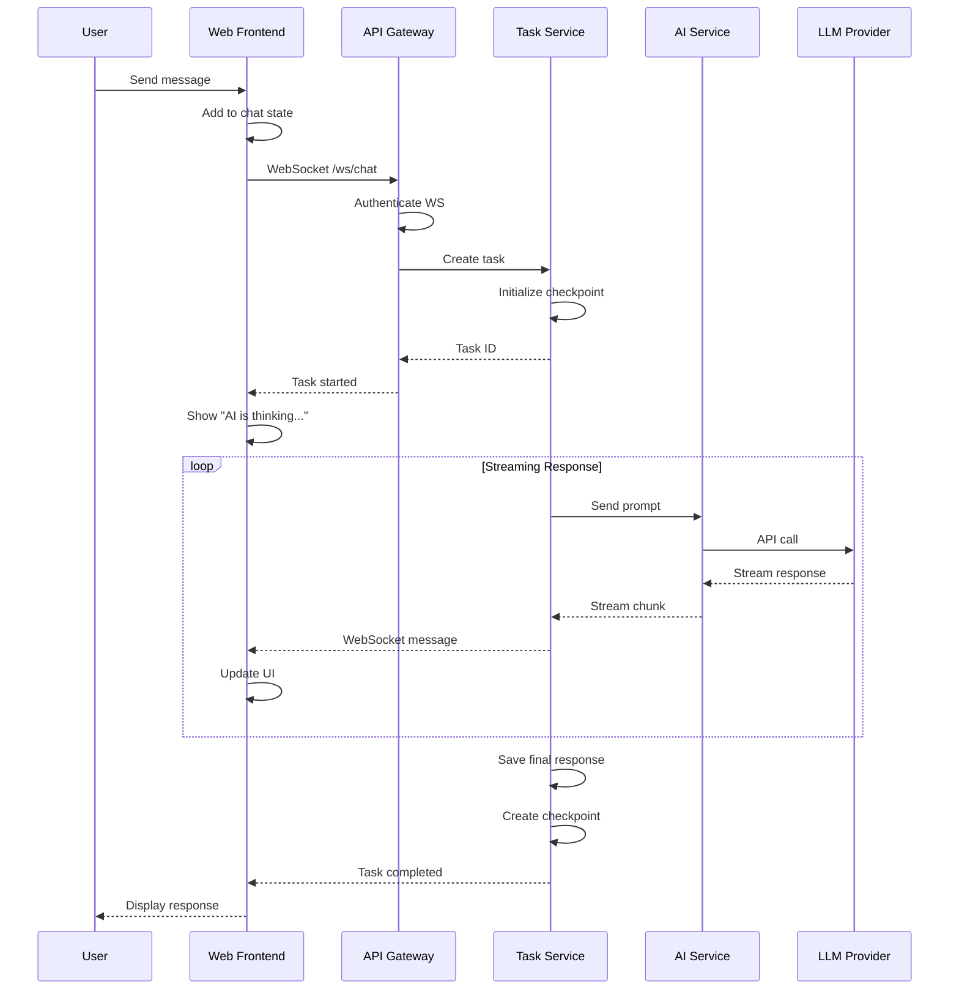
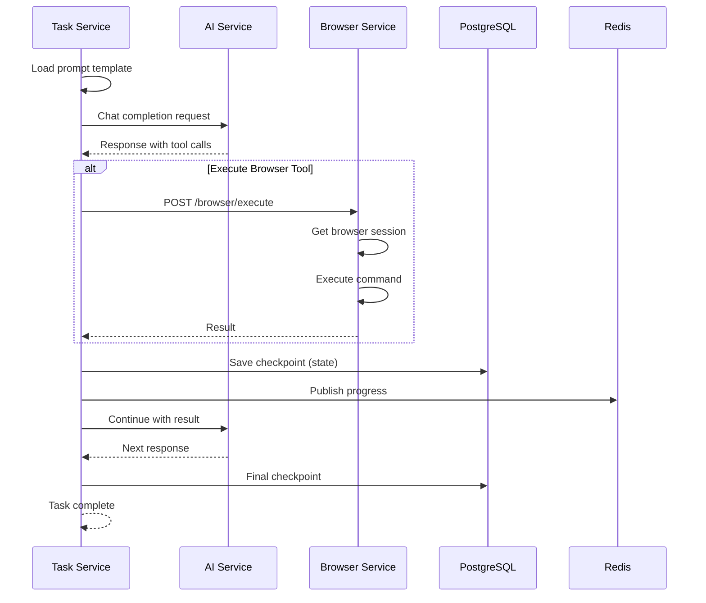
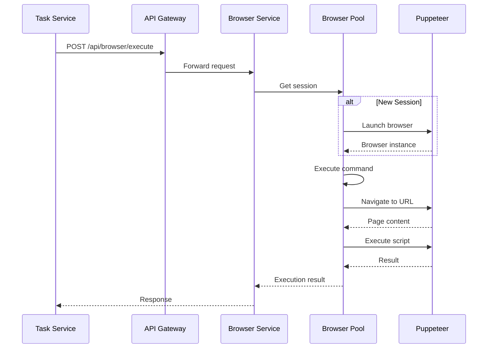
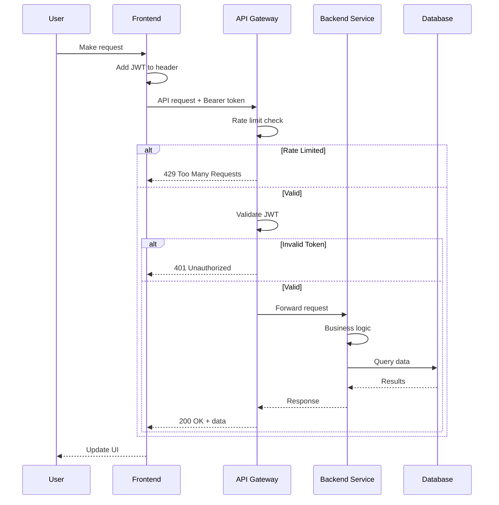
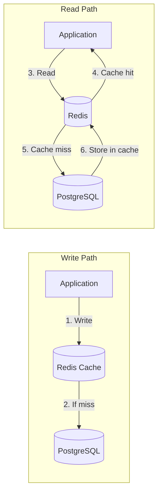
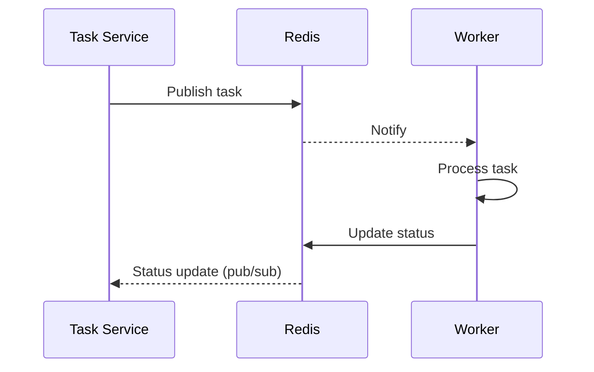

# Data Flow/Sequence Diagram

## Key Business Flows

### 1. User Authentication Flow

### 2. Chat Message Flow

### 3. Task Execution Flow

### 4. Browser Automation Flow

### 5. API Request Flow (REST)

## Data Storage Flow

## Message Queue Flow

